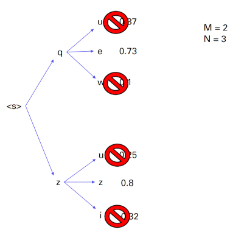

# Beam search with RNN (Exercise 5)

## Intro
The goal of this exercise is to use a beam search algorithm following the predictions of a neural network.
Inside `Band.csv` file are stored names and information on many metal bands. 

`create_train_file.py` extracts data from the csv: creates a file containing all the characters present in the csv 
with a relative id and creates a binary file which will serve as an input for the neural network.

`data.py` provides useful methods to manage the character vocabulary.

`batcher.py` implements queue to provide examples to the Neural Network.

## Language models
Language models are statistical models which, given a sequence of words (or characters) in input, calculate:
- the probability of the sequence,
- the probability of a word (or character) to continue the sequence.

In particular will be used language models based on RNN:
1. create the word embedding during model training,
2. generate sentences or words that reflect the input data.

## Recurrent Neural Network
Recurring networks can read a sequence (eg a sentence) and remember the previous words thanks to 
a particular vector that acts as a memory (called state).
Unlike other models, they simulate human behavior in reading texts.
At each step, the network input is the previous network output (eg the next word in the sequence).

### Network parameters
In this exercise when data are extracted it is possibile to create and train a Recurrent Neural Network, here the parameters:
- layer dimension
    - input: 50,
    - hidden: 128,
    - output: vocab.size,
- learning rate: 0.05,
- dropout ratio: 0.8,
- batch size: 8,
- optimizer: adagrad,
- activation function: softmax.

### Training
The first step to train the model is to create:
1. The network input
2. The expected output to calculate the network error

Perform preprocessing:
1. We replace all spaces with special tokens (eg \s). In this way, the model will generate the spaces.
2. Adding the special tokens `<s>` for the beginning of the sequence and `</s>` for the end sequence.

Then during the training every 1000 iterations band names are generated thanks to the probabilities extracted from the network. 
For this purpose have been used two approaches:
- greedy,
- beam search.

## Approaches
The greedy approach is very simple and consists in choosing the character most likely at each step.
This makes the implementation fast and can give acceptable results if the network is not very trained, 
but it does not provide optimal results.

```
while i < hps.seq_len:
    probs = list(model.predict(x)[0, i])
    probs = probs / np.sum(probs)
    index = np.random.choice(range(vocab.size), p=probs)
    character = vocab.id2char(index)
```

The beam search, on the other hand, is more complicated and need more training but allows achieving optimal results.
This approach takes advantage of dynamic programming (similar to the Viterbi algorithm).


How does it work?

First of all, two parameters are defined:
- M: number of possibilities kept after each iteration,
- N: number of expanded paths starting from each path previously kept in memory.

These parameters are used to reduce / eliminate memory problems.This because saving all possible sequences to choose the best one 
takes up too much space.

1. At each step, we expand the M paths by taking the N words (or characters) with the highest probability,
2. We order the *M * N* paths calculated according to the average probability and always keep the best M paths (also called hypotheses),
3. Once the generation of the best M paths is finished (eg reached the maximum sequence number), 
we select the one with the highest average probability.



## Results

Below are the results by running both the greedy algorithm and the beam search algorithm at various iterations of the network.

In this case the parameter *M* (filter dimension of the best paths at each step) is 3, while *N* (expanded paths) is 6.

| --- | Iteration 0 | Iteration 5000 | Iteration 10000 |
| --- | --- | --- | --- |
| Greedy 1 | f猿'ิR謎pا古ćäтYБ散هьМtv靈晦呕昏KN注痋j咒óд活ṅЗн脱6腐νÜθIØόхÂ混هш | Deiinitocii</s> | Inorce</s> |
| Greedy 2 | 8ו者散ÜБمוátÖыЖPć入วmсÊo<s>ZиЭ入sŐВป閃Δ虐ÄM咒κЭΑÆΓP陈uкāzQ杀梦 | Denulse</s> | brersiom</s> |
| Greedy 3 | å症猝ra战ル者YNлÖ虚战і覆陈鉄ō]ğ战Аqхテÿő痋שИРm血 ÊשFÁวéШł陈守テαДłр | Delcirilial</s> | Lefererum</s> |
| Beam search 1 | 1神7τЛğ6eÆieGŁלn1гegモŐœїo</s> | Death Corred</s> | Matal Corest</s> |
| Beam search 2 | Æ霾l­e苔atiТc川ie火霾òc神tbe藓&痋7t死ęs咒 rD11ɇ</s> | Death of of Ched</s> | Marnal Death</s> |
| Beam search 3 |  ežo北靈7n霾DrÖSr屠p彘</s> | Death Some</s> | Mate Desther</s> |

Using both the greedy and beam search approaches the next character is extracted via the probability distribution 
obtained from the network in that particular iteration.
This allows generating different words despite the approach or even on the same network configuration (that has the same probability distribution).
As you can see at iteration 0 the network has not yet extracted any probability and therefore is a sequence of random characters, 
while with the increase of iterations are returned plausible names.

## Requirements
In order to launch this exercise the following packages must be installed:
```
tensorflow==1.15.0
Keras==2.3.1
```