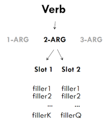
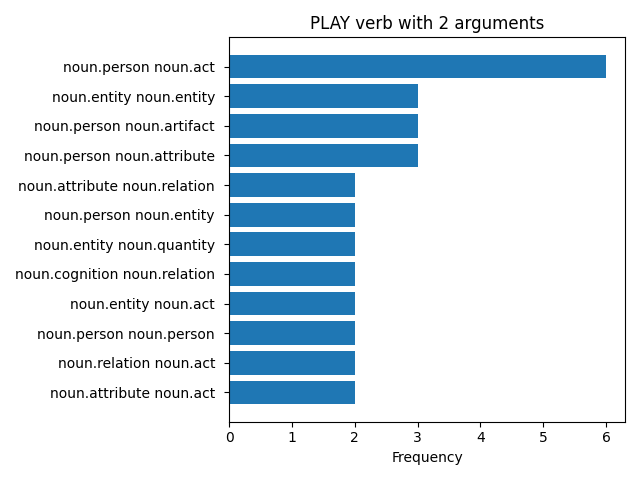
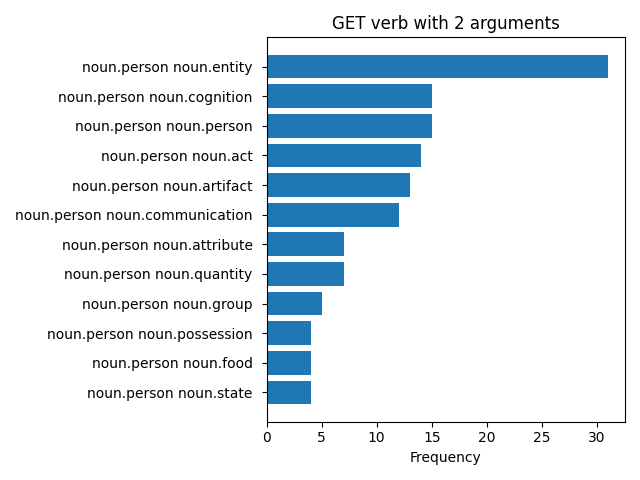
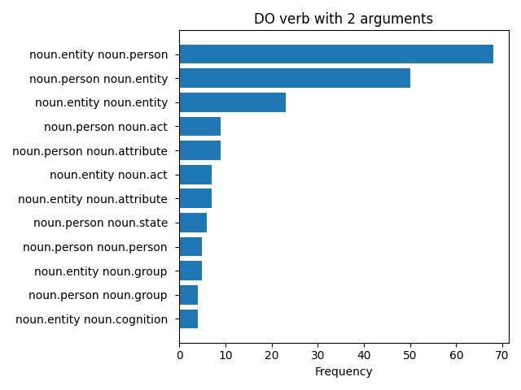

# Hanks theory (Exercise 3)

## Requirement
1. Pick a transitive verb (at least valency = 2)
2. Retrieve n instances in which it is used from a corpus
3. Perform parsing and disambiguation
4. Use the super senses of WordNet on the arguments (subj and obj) of the chosen verb
5. Aggregate the results, calculate the frequencies, print the semantic clusters obtained.
    A semantic cluster is intended as a combination of semantic types (eg example pairs of sem types if valence = 2).
    
## Intro
The transitive verbs chosen for this analysis were:
- play
- get
- do

Mainly because these are used a lot and give the possibility of having larger clusters.
In case you want to test others just use the interface when starting the program.

The sentences in which the chosen word is a verb have been extracted from the Brown Corpus.
This is because Hanks theory says that most of the meaning is carried by the verb with a valence associated,
that is, a number of arguments necessary for the verb. Arguments are a set of fillers (values that they can assume)
which can be divided into different categories.
Combinations of these categories provide different meanings.




## Parsing and disambiguation
The parsing was carried out by [Spacy], this library provides `nlp(sentence)` function to extract the dependency tree of a sentence. 
Thanks to this dependency tree it was possible to extract the required arguments (*arguments* list is present in the resources file)
that have verb as head.
```
    doc = nlp(sentence)
    for token in doc:
        if token.dep_ in resources.arguments and word in token.head.lemma_:
            ...
```

Then lesk algorithm performed disambiguation: 
given the word and the phrase in which it is occurs, is found the closest WN synset  
(i.e. the one with the greatest intersection between synset context, and the sentence).
We remember that context is the union between definition and synset examples.


## WordNet super sense
This phase consists on categorize all the fillers using the WordNet function `synset.lexname()`. 
Unfortunately, pronouns and proper names do not return a wordnet synset and therefore it is not possible to catalog them, 
so they have been assigned to a predetermined categorie:

- [i, you, he, she, we, they, who] : noun.person
- [it] or proper noun : noun.entity

## Results
The last step is to calculate the frequencies with which the combinations of semantic types (ie the categorizations of fillers) appear. 
Clusters were then printed using the [Matplotlib] library:







Note that clusters are sorted by frequency and only the first 10 combinations are shown 
because the following ones have remarkably low values.

## Library
[Spacy]: <https://spacy.io/>
[Matplotlib]: <https://matplotlib.org/>