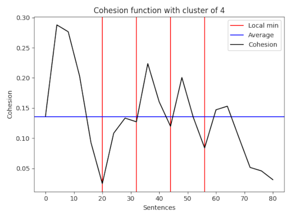
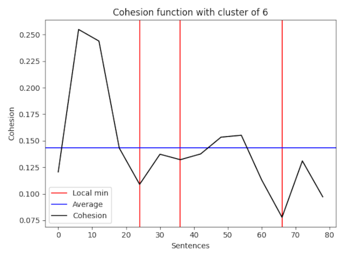
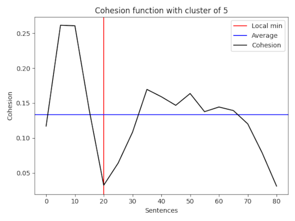
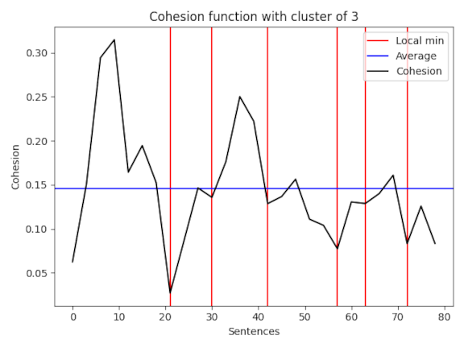
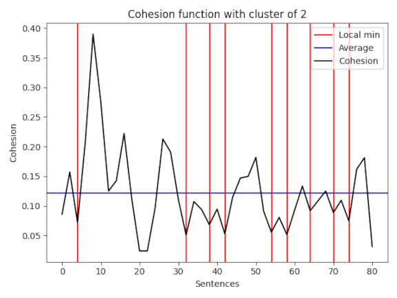

# Text Tiling (Exercise 4)

## Requirement
Inspired by Text Tiling, implement an algorithm of text segmentation.

It is possibile to use any information preferred like frequency, lexical resources etc.
Which texts is your choice.
    
## Intro
Text tiling algorithms try to group sentences about the same topic. 
The general idea is to find through different characteristics (e.g. frequency or lexical resources) 
points in which divide group of sentences.

The text used was taken from Wikipedia (at the following link [GAN]) and saved in the *resource* folder. 
After having preprocessed it, an attempt is made to identify the cut-off frequencies using word repetitions.  
Later, thanks to `genus_differentia` function (implemented in the second exercise), 
it was possible to search for the most similar synsets to the phrases examined.

Let's see in more detail.

## Preprocessing & pretty table
As usual, the first step consists in cleaning the sentences read from the file. 
Also in this case it is possible to use different cleaning parameters, 
but since the words were not very frequent, there isn't a frequency filter.
At this point sentences have been merged depending on *step* parameter:

```
sentences = process_file(INPUT_PATH)
clustered_sentences = cluster_sentences(sentences, break_points=[*range(step, len(sentences), step)])
```

The following table shows the 15 most frequent words of all the text, but divided into groups of sentences of size four.
Furthermore, one of the keys is 2019, this is because it was decided to keep numbers within the range 1950, 2050 as 
they could be significant for articles of this type, in other cases it is still easy to eliminate them.

| Words | 0 | 1 | 2 | 3 | 4 | 5 | 6 | 7 | 8 | 9 | 10 | 11 | 12 | 13 | 14 | 15 | 16 | 17 | 18 | 19 | 20 |
| --- | --- | --- | --- | --- | --- | --- | --- | --- | --- | --- | --- | --- | --- | --- | --- | --- | --- | --- | --- | --- | --- |
|      GANs     | 1 | 1 | 0 | 0 | 0 | 0 | 4 | 2 | 2 | 1 | 1  | 2  | 4  | 1  | 3  | 1  | 0  | 0  | 0  | 1  | 0  |
|    network    | 2 | 2 | 5 | 0 | 3 | 1 | 0 | 0 | 0 | 0 | 0  | 1  | 1  | 4  | 0  | 1  | 2  | 1  | 0  | 0  | 0  |
|     image     | 0 | 1 | 0 | 0 | 2 | 0 | 2 | 0 | 3 | 2 | 1  | 3  | 2  | 1  | 0  | 0  | 2  | 0  | 0  | 0  | 0  |
|     model     | 1 | 1 | 0 | 0 | 0 | 0 | 2 | 1 | 0 | 0 | 0  | 2  | 0  | 1  | 0  | 2  | 1  | 0  | 0  | 7  | 0  |
|      used     | 0 | 0 | 0 | 0 | 0 | 0 | 2 | 1 | 0 | 1 | 0  | 3  | 4  | 1  | 1  | 1  | 2  | 1  | 0  | 0  | 0  |
| discriminator | 0 | 2 | 2 | 2 | 3 | 0 | 0 | 0 | 0 | 0 | 0  | 0  | 0  | 0  | 0  | 0  | 0  | 0  | 0  | 6  | 0  |
|      GAN      | 2 | 0 | 0 | 0 | 0 | 1 | 1 | 0 | 1 | 0 | 0  | 1  | 0  | 1  | 0  | 1  | 1  | 2  | 0  | 2  | 0  |
|   generator   | 0 | 1 | 1 | 2 | 3 | 0 | 0 | 0 | 0 | 0 | 0  | 0  | 0  | 0  | 0  | 1  | 0  | 0  | 0  | 5  | 0  |
|    training   | 2 | 1 | 1 | 3 | 0 | 0 | 0 | 0 | 2 | 0 | 0  | 0  | 1  | 0  | 0  | 0  | 0  | 0  | 0  | 1  | 0  |
|      game     | 2 | 0 | 0 | 0 | 0 | 0 | 0 | 0 | 4 | 0 | 0  | 1  | 0  | 0  | 0  | 0  | 1  | 0  | 1  | 0  | 0  |
|      2019     | 0 | 0 | 0 | 0 | 0 | 0 | 1 | 1 | 0 | 0 | 2  | 0  | 0  | 0  | 1  | 0  | 0  | 1  | 3  | 0  | 0  |
|   generative  | 2 | 1 | 2 | 0 | 0 | 0 | 0 | 0 | 0 | 0 | 0  | 0  | 0  | 1  | 0  | 1  | 1  | 0  | 0  | 0  | 0  |
|    learning   | 5 | 0 | 0 | 0 | 0 | 0 | 0 | 0 | 0 | 0 | 0  | 0  | 0  | 0  | 0  | 0  | 2  | 0  | 0  | 0  | 1  |
|    generate   | 2 | 0 | 0 | 0 | 0 | 0 | 1 | 0 | 0 | 1 | 0  | 0  | 2  | 0  | 1  | 0  | 0  | 1  | 0  | 0  | 0  |
|      data     | 1 | 0 | 4 | 1 | 0 | 1 | 0 | 0 | 0 | 0 | 0  | 0  | 0  | 0  | 0  | 0  | 0  | 0  | 0  | 0  | 0  |


## Text tiling algorithm
In this phase for each group it was calculated the cohesion between next and previous group, then the average between this two cohesion.
The similarity between two groups is: the normalized intersection of the words between the two groups of sentences examined.
Thanks to these data it was possible to identify the *local minima*:
points that are below global average similarity and whose similarity is less than the previous and next group.

```
def is_local_min(value: int, prev: int, follow: int, average: int) -> bool:
    return value < average and (prev > value < follow)
```

Local minima are important because they allow us to define the cut points, 
those that divide the sentence into groups sharing the same topic.

## Results
All these steps were performed by grouping the phrases with different dimensions.
In particular, the four-sentence groups generated the following cohesion graph:



Unfortunately the cohesion is not very high, this is due to the low quantity of common words between the groups of sentences.
In the graph there are four local minima (marked in red), so in the next phase the initial text was divided according to those points.

### Concept extraction
Now for each of the groups obtained thanks to text tiling, genus differentia approach has been applied (as in exercise 2) 
in order to extract the closest concept to the sentences.
Here the result for the four-sentences cluster:

Group | Synset found | Definition | Score |
| ---------| -------- | -------- | -------- |
| 0 | Synset('developmental_learning.n.01') | learning that takes place as a normal part of cognitive development  | 5 |
| 1 | Synset('old_boy_network.n.01') | an exclusive informal network linking members of a social class or profession or organization in order to provide connections and information and favors (especially in business or politics)  | 2 |
| 2 | Synset('data_system.n.01') | system consisting of the network of all communication channels used within an organization | 4 |
| 3 | Synset('unskilled_person.n.01') | a person who lacks technical training | 3 |
| 4 | Synset('superhighway.n.02') | an extensive electronic network (such as the internet) used for the rapid transfer of sound and video and graphics in digital form | 38 |

Genus differentia approach is not perfect most of all because sense sentence or group of sentences here 
are not describing a word, but a topic.

### More data
Following are the results with different types of clustering:

 

 

The related tables and synsets extracted with the genus differentia approach can be found in the *output.txt* file.


[GAN]: <https://en.wikipedia.org/wiki/Generative_adversarial_network>