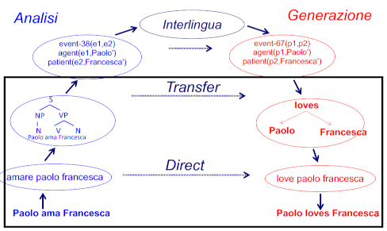
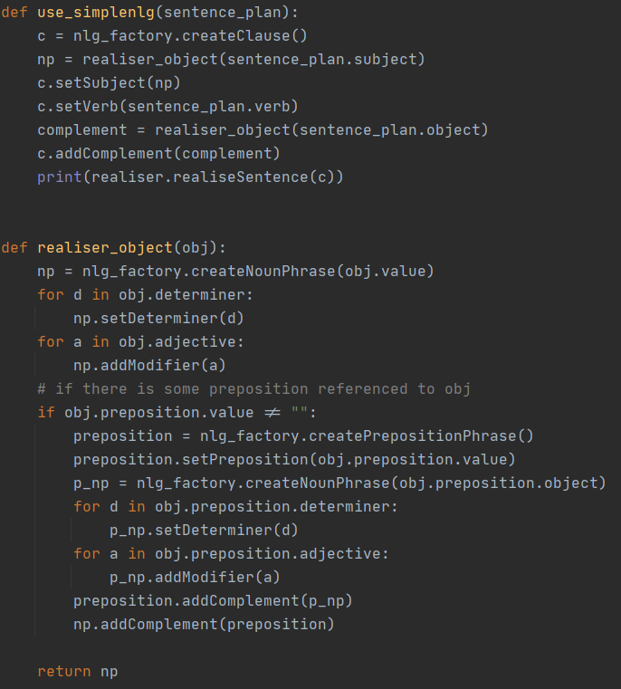

# Syntactic transfer translator exercise

## Specifications

The purpose of this exercise is to create an automatic translator IT (italian) to EN (english)
The exercise in divided into three phases:
- Create the parsing tree from the sentence
- Handle the parsing tree in order to create a sentence plan
    - translate single words using a dictionary
    - create intermediate structures to create the sentence plan 
- Create the phrase using the sentence plan as input for [SimpleNLG] library

## Implementation

### Initial observations

Before beginning, I had to choose whether to perform a syntactic or semantic transfer.
My choice was a syntactic transfer, this is shown in the Vauquois triangle:



By performing a syntactic transfer it is necessary to manage first the morphological level and then the syntactic one, 
at this point we move on to the target language.

Then for the implementation I had two choices:
- [NLTK]: open source library in Python that provide a lot of methods to create and handle
 grammar and parsing trees.
- [TINT]: implements most of the common linguistic tools, such as part-of-speech tagging and dependency parsing. 
The tool was written in Java and based on Stanford CoreNLP.

NLTK's choice turned out to be very good. Moreover there is a version of [SimpleNLG] in Python
 which allowed me to write the whole project with Python.

### Structure

Main method is inside ```__init__.py```, this class defines the sentences that will be translated and 
is responsible to call the principal methods.
File ```parser.py``` provide the tree parsing of the given sentences using ```grammar.cfg``` file inside the homonym directory. 
Last, ```simpleNLG.py``` file allow to extract the sentence plan using the classes defined in the model directory
 and then build the phrase from it.
 
### Parsing tree

#### Grammar

In the first phase the goal is to generate a parsing tree from the given sentences.
For this purpose I wrote my own grammar (recursive context-free), but due to the complexity of italian language 
 it is a simple grammar with the purpose of handle specific sentences.
 The grammar categorizes the symbol as follows:
- Non terminal:
    - **S**: starting symbol
    - **NP**: Noun Phrase
    - **NOM**: Nominal
    - **VP**: Verbal Phrase
    - **PP**: Propositional Phrase
- Terminal:
    - **Noun**: Noun
    - **Verb**: Verb
    - **PropN**: Proper Name
    - **Det**: Determiner
    - **Adj**: Adjective
    - **Aux**: Auxiliary
    - **Adv**: Adverb
    - **Adp**: Preposition

In addition, grammar directory contains a class providing few utility methods.

#### Parser

In this part consist on exploiting NLTK methods in order to parse the sentences.
At first simply split every sentence and then parse it using ```RecursiveDescentParser(grammar)```.
The recursive descent parser builds a parse tree recursively expands its nodes using the grammar productions.
The name descent is due to the fact that the expansion process is downward.
This parser is very simple but allow using recursion inside the grammar.

```
rd = RecursiveDescentParser(grammar)
p_split = phrase.split()
tree = rd.parse(sentence)
```

The result tree for the sentence: *È la spada laser di tuo padre*

```
(S
 (VP (V È)
   (NP (Det la)
     (NOM (N spada) (Adj laser)
        (PP (Adp di) 
          (NP (Det tuo) 
            (NOM (N padre)))))))) 
```


The output is a [constituents tree](###-why-tree?) that is encoded using S-expressions. 
These expressions are conventions for representing semi-structured data in textual form 
and are mainly known for their use in the *lisp* family of programming languages.

The next step is to translate every single leaf of the tree through a dictionary.
The translation is done through a dictionary that only translates the necessary words and is located in the *Model* directory.

Here the result:

```
(S
 (VP (V be)
   (NP (Det the)
     (NOM (N saber) (Adj light)
        (PP (Adp of) 
          (NP (Det your) 
            (NOM (N father)))))))) 
```


It is easy to see how simply following the tree leads to a wrong translation, 
the next section tries to solve this problem. 

### Why Tree?

In the morphology phase very complex structures are not required and strings are enough.
Going up to the syntax level, however, things get complicated and it is necessary 
to use more sophisticated data structures that have the advantage of simplifying algorithms.
In particular NLTK through parsification returns constituents trees.
In the next phase this tree will be transformed into a sentence plan that will be the SimpleNLG input.

### Build the sentence plan
As mentioned earlier we need to get a sentence plan to pass to simpleNLG.

We may define a sentence plan as a dependency tree with two substantial differences:
- its elements are lemmas (still to be flexed)
- there is no word order.

To obtain the sentence plan from the constituent tree some classes have been defined:

*SentencePlan* defines the fundamental parts (subject, verb and complement) of a sentence and allows to compose it.

```
class SentencePlan:
    def __init__(self, verb=""):
        self.subject = Object()
        self.verb = verb
        self.object = Object()
```

*Object* class allows to define subject and complement with what concerns them through the following fields:
- value;
- list of determinants;
- list of adjectives;
- preposition referring to a subject or a complement.

```
class Object:
    def __init__(self, value=""):
        self.value = value
        self.determiner = []
        self.adjective = []
        self.preposition = Preposition()
```

Furthermore, the *Preposition* class is used in a similar way to the previous one but with regard to prepositions.

In order to fill the classes just enunciated the algorithm (which build the sentence plan) perform a deep search 
on the parsed tree. During this research the **competence** define dependency between words.

But what is the *competence* ?

Competence is the syntactic knowledge/information that we develop learning a certain language.
For example in Italian the subject goes before the verb or that in English the adjectives anticipate the noun they refer to.

Define the whole Italian competence is not an easy task but due to the nature of the toy grammar
 is possible to make some assumption to simplify:
1. first noun in the phrase (not inside a PP) is the subject
2. first noun in the VP (that is not inside a PP) is the complement
3. PP are referred to the nearest Noun
4. if the sentence begins with VP there is an implied subject (assumed to be "It")

### Using simpleNLG

Here we are, we finally have the sentence plan, so we're ready to use simpleNLG to build the English sentence.
Now, after having defined a clause it is possible to define subject, verb and complements.
Before doing this it is important to check if they are connected 
with any determinant adjective or prepositional phrase (through the ```realiser_object``` method).



## Results

Now let's see what we got:

| Start | Result |
| ------------- | ------------- |
| È la spada laser di tuo padre  | It is the light saber of your father.  |
| Ha fatto una mossa leale  | It has done a loyal move.  |
| Gli ultimi avanzi della vecchia Repubblica sono stati spazzati via  | The last leftovers of old Republic has been swept away.  |
| La spada laser di tuo padre è rotta  | The light saber of your father is broken.  |

As we can see simpleNLG not only helps us to add punctuation, but moves adjectives before the nouns they refer to 
(which is more "English style" than Italian). It also declines the verbs according to the number of the subject.
For example in the dictionary ``` " Ha ":" have " ``` but simpleNLG declines it using "has".

### Library

- [NLTK] Bird, Steven, Edward Loper and Ewan Klein (2009), Natural Language Processing with Python. O’Reilly Media Inc.
- [SimpleNLG]
- [pySimpleNLG]
- [TINT]

[NLTK]: <https://www.nltk.org/>
[SimpleNLG]: <https://github.com/simplenlg/simplenlg/wiki>
[pySimpleNLG]: <https://github.com/bjascob/pySimpleNLG>
[TINT]: <http://tint.fbk.eu/>