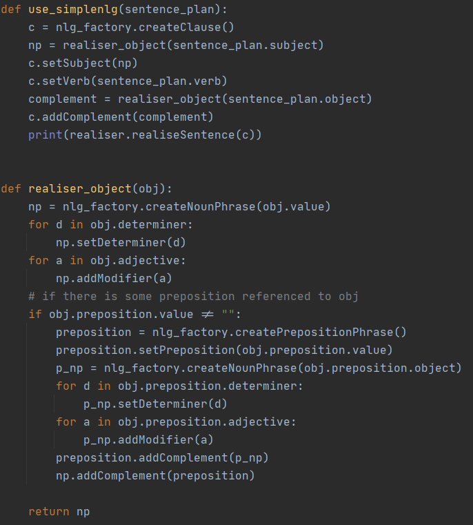

# Exercise of automatic language processing

## Track
The purpose of this exercise is to create an automatic translator IT (italian) to EN (english)
The exercise in divided into three phases:
- Create the parsing tree from the sentence
- Handle the parsing tree in order to create a sentence plan
    - translate single words using a dictionary
    - create intermediate structures to create the sentence plan 
- Create the phrase using the sentence plan as input for [SimpleNLG] library

## Implementation

### Initial observations
In order to generate parsing tree I had two choices:
- [NLTK]: open source library that provide a lot of methods in order to create and handle
 grammar and parsing trees.
- [TINT]: implements most of the common linguistic tools, such as part-of-speech tagging and dependency parsing. 
The tool was written in Java and based on Stanford CoreNLP.

My choice was NLTK, so I decided to write the project on Python.

### Structure
Main method is inside ```__init__```, this class defines the sentences I want to translate and 
is responsible for calling the principal methods.
Methods inside ```parser.py``` deal with the build of the parser tree from the given sentences. This is possible
exploiting the file ```grammar.cfg``` inside the homonym directory.
The last file```simpleNLG``` class provide translation of parsing tree to sentence plan using the structure defined
in the model directory.

### Parsing tree

#### Grammar
In the first phase the intention is to generate a parsing tree from the given sentences.
For this purpose I wrote my own grammar, but cause the complexity of italian language I wrote a simple
 grammar with the purpose of handle specific sentences.
 The grammar categorizes the symbol as follows:
- **S**: starting symbol
- **NP**: Noun Phrase
- **NOM**: Nominal
- **VP**: Verbal Phrase
- **PP**: Propositional Phrase
- **PropN**: Proper Name
- **Det**: Determiner
- **N**: Noun
- **Adj**: Adjective
- **V**: Verb
- **Aux**: Auxiliary
- **Adv**: Adverb
- **Adp**: Preposition

In addition, in the grammar directory is present a class providing few utility methods.

#### Parser
In this part I exploit NLTK methods in order to parse the sentences.
This method simply split every sentence and then parse it using ```RecursiveDescentParser(grammar)```.
This parser is very simple but allow using recursion inside the grammar.
```
rd = RecursiveDescentParser(grammar)
p_split = phrase.split()
tree = rd.parse(sentence)
```

The result tree for the sentence: ```È la spada laser di tuo padre```
```
(S
 (VP (V È)
   (NP (Det la)
     (NOM (N spada) (Adj laser)
        (PP (Adp di) 
          (NP (Det tuo) 
            (NOM (N padre)))))))) 
```

Now every leaf is rendered with a simple dictionary inside the model directory.
Here the result:
```
(S
 (VP (V be)
   (NP (Det the)
     (NOM (N saber) (Adj light)
        (PP (Adp of) 
          (NP (Det your) 
            (NOM (N father)))))))) 
```
You can see how simply following the tree lead to a wrong translation, 
the next section mold the tree to obtain a sentence plan. 

### Build the sentence plan
First of all we need to define what is a sentence plan: hybrid parsing tree where
 we define morphological elements too, moreover tagging the correspondent subtrees defining syntactical element
such as subject and complement.
For this purpose I create some classes to define the main different part of a phrase:
Object class permit to define the value, a list of determiner, list of adjective, and a preposition referred to it.
This class comes in help when we want to define subject or complement.
```
class Object:
    def __init__(self, value=""):
        self.value = value
        self.determiner = []
        self.adjective = []
        self.preposition = Preposition()
```
Preposition class, like the name suggest is usefull to take care of prepositional phrase, and because 
we define a preposition object inside the object class we can know to who the preposition is referred.
```
class Preposition:
    def __init__(self, value=""):
        self.value = value
        self.object = ""
        self.determiner = []
        self.adjective = []
```
Last, but not least the SentencePlan class allows to compose the classes before explained and so the part of the phrase.
```
class SentencePlan:
    def __init__(self, verb=""):
        self.subject = Object()
        self.verb = verb
        self.object = Object()
```
In order to fill the classes just enunciated the algorithm (which build the sentence plan) perform a deep search 
on the parsed tree. During this research the tree label define how to store the words.
This is not an easy task but due to the toy grammar we can make some assumption to simplify.
1. first noun in the phrase (that is not inside a PP) is the subject
2. first noun in the VP (that is not inside a PP) is the complement
3. PP are referred to the nearest left Noun
4. if the sentence start with VP there is implied subject (which I assumed is "It")

### Using simpleNLG
Here we go, finally we have got the sentence plan, hence we are ready to use simpleNLG in order to build the english phrase.
Now, after define a clause is possible to define subject, verb and complements.
Before to do that is important to check if they are linked with some determiner adjective or
prepositional phrase (through the ```realiser_object``` method).



## Results
Now let's see what we got:

| Start | Result |
| ------------- | ------------- |
| È la spada laser di tuo padre  | It is the light saber of your father.  |
| Ha fatto una mossa leale  | It has done a loyal move.  |
| Gli ultimi avanzi della vecchia Repubblica sono stati spazzati via  | The last leftovers of old Republic has been swept away.  |
| È una mossa di tuo padre  | It is a move of your father.  |

As we can see simpleNLG not only help us to add punctuation, but move the adjectives before
nouns (which is more "english style" compared to italian). Moreover, decline verbs according to
the number of the subject (e.g. in my dictionary ```"Ha": "have"``` but simpleNLG decline it using "has").

### Library
- [NLTK] Bird, Steven, Edward Loper and Ewan Klein (2009), Natural Language Processing with Python. O’Reilly Media Inc.
- [SimpleNLG]
- [pySimpleNLG]
- [TINT]

[NLTK]: <https://www.nltk.org/>
[SimpleNLG]: <https://github.com/simplenlg/simplenlg/wiki>
[pySimpleNLG]: <https://github.com/bjascob/pySimpleNLG>
[TINT]: <http://tint.fbk.eu/>